# strcpy引发的内存溢出问题

## 实验目的  

本次实验通过一段可能引发安全问题的代码，测试strcpy函数存在的内存溢出问题

## 程序测试代码  

```C
#define _CRT_SECLRE_NO_WARNINGS //编译时忽视错误

#include<stdlib.h>
#include<stdio.h>
#include<string.h>

int sub(char* x) {
  char y[10];
  strcpy(y, x);
  return 0;
}

int main(int argc, char** argv) {
  if (argc > 1)
     sub(argv[1]);
     printf("exit");
}
```

## VisualStudio配置  

VisualStudio自带了许多安全检测功能，目的为督促程序员进行安全开发，但本次实验中需取消这些设定，查看错误的具体情况。

- 在项目属性设置中，将“启用C++异常”设置为否
- 禁用“安全检查”  
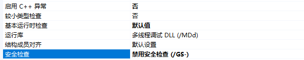  
- 禁用SDL检查  
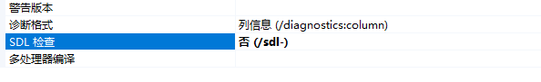  
- 修改“调试”的命令参数设置为任意字符串（此处为fffffffffffffffffffffff）  
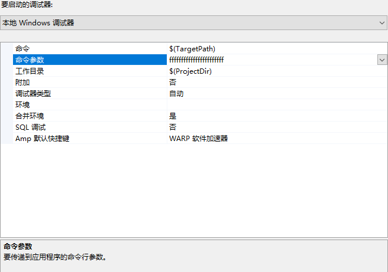  

## 测试阶段  

注：*由于在实验中出现连点，遗漏等现象，截图并不来自同一次运行，寄存器对应的值虽有不同，但不影响进一步比较和观测学习*  

- 在strcpy函数前设置断点，然后F5编译程序，逐过程/逐语句调试  
- 启用“反汇编”，设置显示代码字符和地址
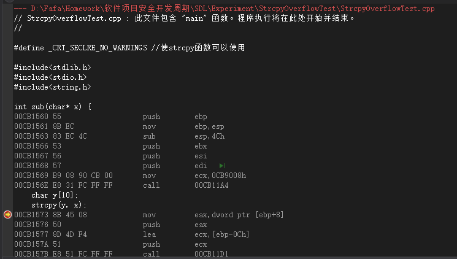  
  - EAX，EBX，ECX，EDX——一般寄存器，cpu主要操作的对象。
  - ESP——堆叠指标暂存器，存放当前线程的栈顶指针，堆栈的顶部是地址小的区域，压入堆栈的数据越多，ESP也就越来越小。  
  - EBP——基底指标暂存器，存放当前线程的栈底指针。  
  - EIP——寄存器存放下一个CPU指令存放的内存地址，当CPU执行完当前的指令后，从EIP寄存器中读取下一条指令的内存地址，然后继续执行。  

- 当程序运行到断点位置时，EIP的地址与要执行的下一则语句相同，此处与mov指令的地址相同。  
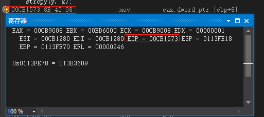  
  - 此时在内存中搜索EAX的值，可以看到该地值存储的即为预先输入的字符串。
  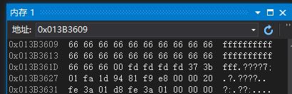  
- 即将进入下一过程，EAX此时存放源字符串的地址的值，EAX压入栈中，栈顶指针ESP减少4字节  
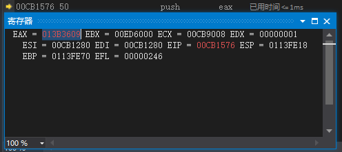  
- 执行到call语句前，EIP继续变化，ECX保存y的地址值，将y值压入了栈中，栈顶指针ESP再减少4个字节  
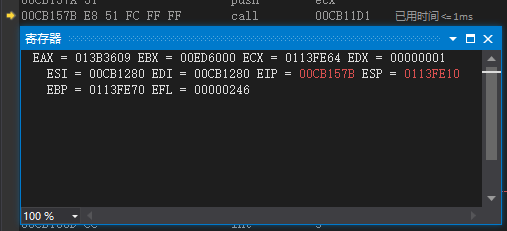  
- 此后，程序执行call指令，来到strcpy的代码区域，再次jump到具体操作的代码  
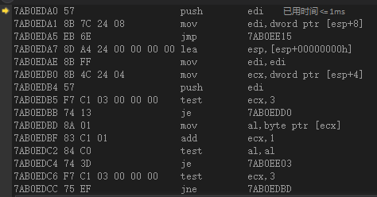
- 随后执行mov操作，将EDX数据寄存器存放的从x中拿到的数据，移交给给ECX
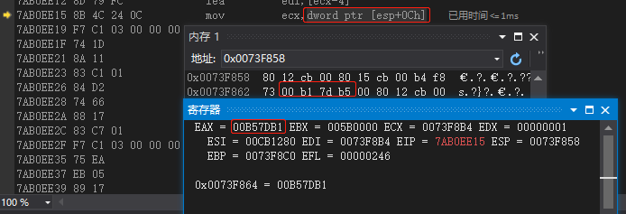  
  - 可以看到在mov操作结束后ECX的值已经和EAX相同  
  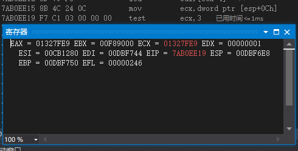  
- 继续执行代码，可以看到ECX中的值已经完成了拷贝，但EAX的内容已经出现了错误，无法查看
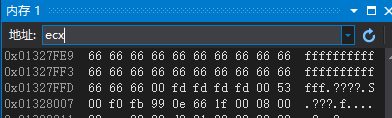  

## 实验结果

strcpy成功引发了溢出错误

## 错误分析

实验中在定义x和y之时，由于x是局部变量，定义在新栈桢内部，被压入旧栈，x的值在底层（地址值较大）所以如果把x赋值给y，那么y在接受这个长字符串后，本身存储空间较小，复制工作只负责全部转移，就会发生溢出现象，占用栈内其它部分的内存和后续内存空间。  

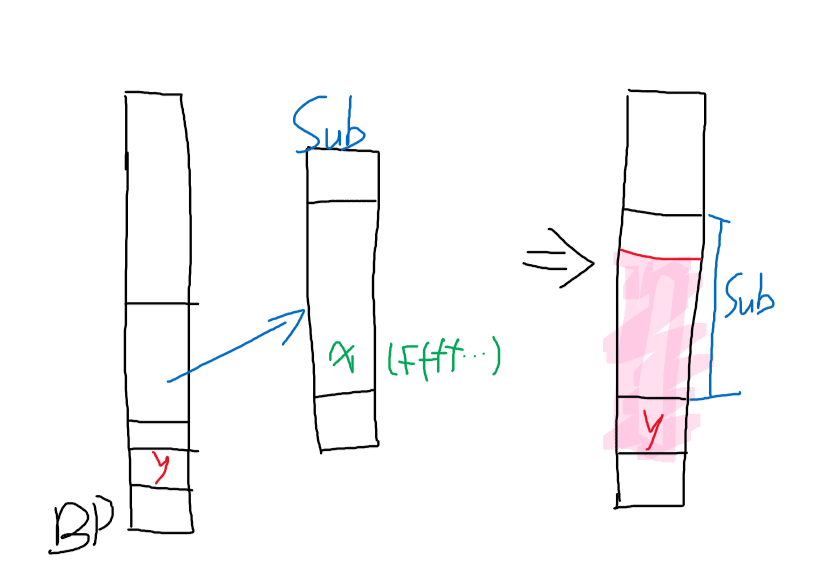

将长字符串赋值给短字符串时，因为短字符串所占的内存空间不足，如果强行赋值，则会造成内存溢出现象。如本次实验中，x复制到y后，系统只会负责将x地址后n单位长度的f移到y地址后，尽管y的存储空间不足，系统仍会执行超出部分，导致占用后续x的存储空间，产生数据抹除等现象，若该地址为系统重要进程使用，则可能影响操作系统崩溃等问题。

## 总结  

在使用strcpy时需格外注意数组越界问题的检查和预算，尽可能提前发现，修改越界问题，防止内存溢出现象的出现。

## 或者不要使用strcpy，尝试使用安全的的方法
