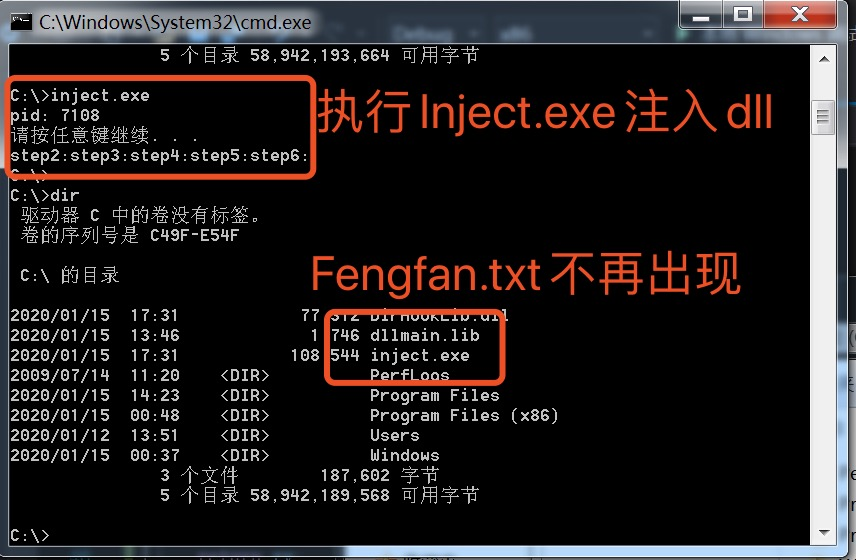

# 期末作业

---

## 实验目标

通过注入DLL方式实现对dir函数功能的改写和修改。
更改dir时调用的`FindFirstFile`，每次出现"Fengfan.txt"便抹掉此结果，使得系统控制台的dir命令看不到目录下的Fengfan.txt

---

## 实验环境

* 虚拟机windows7环境
* 64位cmd
* VisualStudio2019

---

## 实验过程

1. 确定hook函数
   * 查询资料文档了解到，windows系统在dir时调用的函数为`FindFirstFileExW`和`FindNextFileW`
   * dir显示目录下文件时调用了一次`FindFirstFileExW`和多次`FindNextFileW`，所以使用这两个函数进行hook
   * 通过dll注入操作对这两个函数进行监控，检测到调用时，执行后续操作阻碍dir的正常运行。

	```c++
	HANDLE WINAPI FindFirstFile(
		LPCSTR             lpFileName,//  查找的文件类型。例如:.txt,.ini,.cpp等后缀
		LPWIN32_FIND_DATA  lpFindFileData,//得到当前所杳找文件的一些属性，包括文件名，文件大小创建时间等
	);//根据文件名查找文件，函数执行成功返回一个搜索句柄

	BOOL FindNextFile(
	HANDLE hFindFile,                            //FindFirstFile返回的HANDLE
	LPWIN32_FIND_DATA lpFindFileData            //所杳找文件的一些属性
	);//成功返回非零，失败返回零

	typedef struct _WIN32_FIND_DATA 
	{
	DWORD dwFileAttributes; //文件属性
	FILETIME ftCreationTime; // 文件创建时间
	FILETIME ftLastAccessTime; // 文件最后一次访问时间
	FILETIME ftLastWriteTime; // 文件最后一次修改时间
	DWORD nFileSizeHigh; // 文件长度高32位
	DWORD nFileSizeLow; // 文件长度低32位
	DWORD dwReserved0; // 系统保留
	DWORD dwReserved1; // 系统保留
	TCHAR cFileName[ MAX_PATH ]; // 长文件名（最多可达 255 个字符的长文件名），带句点和扩展名
	TCHAR cAlternateFileName[ 14 ]; //8.3格式文件名（句点前最多有8个字符，而扩展名最多可以有3个字符）
	} WIN32_FIND_DATA, *PWIN32_FIND_DATA;
	```

2. 编写dllmain.cpp，其中hook的函数更改为`FindFirstFileExW`和`FindNextFileW`
   * 设定两个Fake函数分别对应`FindFirstFileExW`和`FindNextFileW`
   * 在实现过程中，当发现的目标文件后，移除句柄即可。

	```c
	#include <windows.h>

	#define FILENAME "Fengfan.txt"
	LONG IATHook(
		__in_opt void* pImageBase,
		__in_opt char* pszImportDllName,
		__in char* pszRoutineName,
		__in void* pFakeRoutine,
		__out HANDLE* phHook
	);

	LONG UnIATHook(__in HANDLE hHook);

	void* GetIATHookOrign(__in HANDLE hHook);

	wchar_t* AnsiToUnicode(const char* szStr);

	typedef HANDLE(__stdcall* LPFN_FindFirstFileExW)(
		LPCSTR             lpFileName,
		FINDEX_INFO_LEVELS fInfoLevelId,
		LPVOID             lpFindFileData,
		FINDEX_SEARCH_OPS  fSearchOp,
		LPVOID             lpSearchFilter,
		DWORD              dwAdditionalFlags
		);

	typedef BOOL(__stdcall* LPFN_FindNextFileW)(
		HANDLE             hFindFile,
		LPWIN32_FIND_DATAW lpFindFileData
		);

	HANDLE g_hHook_FindFirstFileExW = NULL;

	HANDLE g_hHook_FindNextFileW = NULL;

	BOOL __stdcall Fake_FindNextFileW(
		HANDLE             hFindFile,
		LPWIN32_FIND_DATAW lpFindFileData
	) {
		LPFN_FindNextFileW fnOrigin = (LPFN_FindNextFileW)GetIATHookOrign(g_hHook_FindNextFileW);
		BOOL rv = fnOrigin(hFindFile, lpFindFileData);
		if (0 == wcscmp(((WIN32_FIND_DATAW*)lpFindFileData)->cFileName, (wchar_t*)TEXT(FILENAME))) {
			return rv;
		}
		return rv;
	}


	HANDLE __stdcall Fake_FindFirstFileExW(
		LPCSTR             lpFileName,
		FINDEX_INFO_LEVELS fInfoLevelId,
		LPVOID             lpFindFileData,
		FINDEX_SEARCH_OPS  fSearchOp,
		LPVOID             lpSearchFilter,
		DWORD              dwAdditionalFlags
	) {
		LPFN_FindFirstFileExW fnOrigin = (LPFN_FindFirstFileExW)GetIATHookOrign(g_hHook_FindFirstFileExW);
		HANDLE hFindFile = fnOrigin(lpFileName, fInfoLevelId, lpFindFileData, fSearchOp, lpSearchFilter, dwAdditionalFlags);
		while (0 == wcscmp(((WIN32_FIND_DATAW*)lpFindFileData)->cFileName, (wchar_t*)TEXT(FILENAME))) {
			FindNextFileW(hFindFile, (WIN32_FIND_DATAW*)lpFindFileData);
		}
		return hFindFile;
	}
		

	BOOL WINAPI DllMain(HINSTANCE hinstDll, DWORD dwReason, LPVOID lpvRevered) {
		switch (dwReason) {
		case DLL_PROCESS_ATTACH:
			IATHook(
				GetModuleHandle(NULL),
				"kernel32.dll",
				"FindFirstFileExW",
				Fake_FindFirstFileExW,
				&g_hHook_FindFirstFileExW
			);
			IATHook(
				GetModuleHandle(NULL),
				"kernel32.dll",
				"FindNextFileExW",
				Fake_FindNextFileW,
				&g_hHook_FindNextFileW
			);
			break;
		case DLL_PROCESS_DETACH:
			UnIATHook(g_hHook_FindFirstFileExW);
			UnIATHook(g_hHook_FindNextFileW);
			break;
		}
		return TRUE;
	}

	#ifdef _RING0
	#include <ntddk.h>
	#include <ntimage.h>
	#else
	#include <windows.h>
	#include <stdlib.h>
	#endif //#ifdef _RING0


	//////////////////////////////////////////////////////////////////////////

	typedef struct _IATHOOK_BLOCK
	{
		void* pOrigin;

		void* pImageBase;
		char* pszImportDllName;
		char* pszRoutineName;

		void* pFake;

	}IATHOOK_BLOCK;


	//////////////////////////////////////////////////////////////////////////

	void* _IATHook_Alloc(__in ULONG nNeedSize)
	{
		void* pMemory = NULL;

		do
		{
			if (0 == nNeedSize)
			{
				break;
			}

	#ifdef _RING0
			pMemory = ExAllocatePoolWithTag(NonPagedPool, nNeedSize, 'iath');

	#else
			pMemory = malloc(nNeedSize);
	#endif // #ifdef _RING0

			if (NULL == pMemory)
			{
				break;
			}

			RtlZeroMemory(pMemory, nNeedSize);

		} while (FALSE);

		return pMemory;
	}


	ULONG _IATHook_Free(__in void* pMemory)
	{

		do
		{
			if (NULL == pMemory)
			{
				break;
			}

	#ifdef _RING0
			ExFreePool(pMemory);

	#else
			free(pMemory);
	#endif // #ifdef _RING0

			pMemory = NULL;

		} while (FALSE);

		return 0;
	}

	//////////////////////////////////////////////////////////////////////////
	#ifdef _RING0


	#ifndef LOWORD
	#define LOWORD(l)           ((USHORT)((ULONG_PTR)(l) & 0xffff))
	#endif // #ifndef LOWORD


	void* _IATHook_InterlockedExchangePointer(__in void* pAddress, __in void* pValue)
	{
		void* pWriteableAddr = NULL;
		PMDL	pNewMDL = NULL;
		void* pOld = NULL;

		do
		{
			if ((NULL == pAddress))
			{
				break;
			}

			if (!NT_SUCCESS(MmIsAddressValid(pAddress)))
			{
				break;
			}

			pNewMDL = IoAllocateMdl(pAddress, sizeof(void*), FALSE, FALSE, NULL);
			if (pNewMDL == NULL)
			{
				break;
			}

			__try
			{
				MmProbeAndLockPages(pNewMDL, KernelMode, IoWriteAccess);

				pNewMDL->MdlFlags |= MDL_MAPPING_CAN_FAIL;

				pWriteableAddr = MmMapLockedPagesSpecifyCache(
					pNewMDL,
					KernelMode,
					MmNonCached,
					NULL,
					FALSE,
					HighPagePriority
				);

				//pWriteableAddr = MmMapLockedPages(pNewMDL, KernelMode);
			}
			__except (EXCEPTION_EXECUTE_HANDLER)
			{
				break;
			}

			if (pWriteableAddr == NULL)
			{
				MmUnlockPages(pNewMDL);
				IoFreeMdl(pNewMDL);

				break;
			}

			pOld = InterlockedExchangePointer(pWriteableAddr, pValue);

			MmUnmapLockedPages(pWriteableAddr, pNewMDL);
			MmUnlockPages(pNewMDL);
			IoFreeMdl(pNewMDL);

		} while (FALSE);

		return pOld;
	}


	//////////////////////////////////////////////////////////////////////////
	#else

	void* _IATHook_InterlockedExchangePointer(__in void* pAddress, __in void* pValue)
	{
		void* pWriteableAddr = NULL;
		void* nOldValue = NULL;
		ULONG	nOldProtect = 0;
		BOOL	bFlag = FALSE;

		do
		{
			if ((NULL == pAddress))
			{
				break;
			}

			bFlag = VirtualProtect(pAddress, sizeof(void*), PAGE_EXECUTE_READWRITE, &nOldProtect);
			if (!bFlag)
			{
				break;
			}
			pWriteableAddr = pAddress;

			nOldValue = InterlockedExchangePointer((volatile PVOID*)pWriteableAddr, pValue);

			VirtualProtect(pAddress, sizeof(void*), nOldProtect, &nOldProtect);

		} while (FALSE);

		return nOldValue;
	}

	#endif // #ifdef _RING0


	LONG _IATHook_Single
	(
		__in IATHOOK_BLOCK* pHookBlock,
		__in IMAGE_IMPORT_DESCRIPTOR* pImportDescriptor,
		__in BOOLEAN bHook
	)
	{
		LONG				nFinalRet = -1;

		IMAGE_THUNK_DATA* pOriginThunk = NULL;
		IMAGE_THUNK_DATA* pRealThunk = NULL;

		IMAGE_IMPORT_BY_NAME* pImportByName = NULL;

		do
		{
			pOriginThunk = (IMAGE_THUNK_DATA*)((UCHAR*)pHookBlock->pImageBase + pImportDescriptor->OriginalFirstThunk);
			pRealThunk = (IMAGE_THUNK_DATA*)((UCHAR*)pHookBlock->pImageBase + pImportDescriptor->FirstThunk);

			for (; 0 != pOriginThunk->u1.Function; pOriginThunk++, pRealThunk++)
			{
				if (IMAGE_ORDINAL_FLAG == (pOriginThunk->u1.Ordinal & IMAGE_ORDINAL_FLAG))
				{
					if ((USHORT)pHookBlock->pszRoutineName == LOWORD(pOriginThunk->u1.Ordinal))
					{
						if (bHook)
						{
							pHookBlock->pOrigin = (void*)pRealThunk->u1.Function;
							_IATHook_InterlockedExchangePointer((void**)&pRealThunk->u1.Function, pHookBlock->pFake);
						}
						else
						{
							_IATHook_InterlockedExchangePointer((void**)&pRealThunk->u1.Function, pHookBlock->pOrigin);
						}

						nFinalRet = 0;
						break;
					}
				}
				else
				{
					pImportByName = (IMAGE_IMPORT_BY_NAME*)((char*)pHookBlock->pImageBase + pOriginThunk->u1.AddressOfData);

					if (0 == _stricmp(pImportByName->Name, pHookBlock->pszRoutineName))
					{
						if (bHook)
						{
							pHookBlock->pOrigin = (void*)pRealThunk->u1.Function;
							_IATHook_InterlockedExchangePointer((void**)&pRealThunk->u1.Function, pHookBlock->pFake);
						}
						else
						{
							_IATHook_InterlockedExchangePointer((void**)&pRealThunk->u1.Function, pHookBlock->pOrigin);
						}

						nFinalRet = 0;

						break;
					}
				}

			}

		} while (FALSE);

		return nFinalRet;
	}


	LONG _IATHook_Internal(__in IATHOOK_BLOCK* pHookBlock, __in BOOLEAN bHook)
	{
		LONG				nFinalRet = -1;
		LONG				nRet = -1;
		IMAGE_DOS_HEADER* pDosHeader = NULL;
		IMAGE_NT_HEADERS* pNTHeaders = NULL;

		IMAGE_IMPORT_DESCRIPTOR* pImportDescriptor = NULL;
		char* pszImportDllName = NULL;


		do
		{
			if (NULL == pHookBlock)
			{
				break;
			}

			pDosHeader = (IMAGE_DOS_HEADER*)pHookBlock->pImageBase;
			if (IMAGE_DOS_SIGNATURE != pDosHeader->e_magic)
			{
				break;
			}

			pNTHeaders = (IMAGE_NT_HEADERS*)((UCHAR*)pHookBlock->pImageBase + pDosHeader->e_lfanew);
			if (IMAGE_NT_SIGNATURE != pNTHeaders->Signature)
			{
				break;
			}

			if (0 == pNTHeaders->OptionalHeader.DataDirectory[IMAGE_DIRECTORY_ENTRY_IMPORT].VirtualAddress)
			{
				break;
			}

			if (0 == pNTHeaders->OptionalHeader.DataDirectory[IMAGE_DIRECTORY_ENTRY_IMPORT].Size)
			{
				break;
			}

			pImportDescriptor = (IMAGE_IMPORT_DESCRIPTOR*)((UCHAR*)pHookBlock->pImageBase + pNTHeaders->OptionalHeader.DataDirectory[IMAGE_DIRECTORY_ENTRY_IMPORT].VirtualAddress);


			// Find pszRoutineName in every Import descriptor
			nFinalRet = -1;

			for (; (pImportDescriptor->Name != 0); pImportDescriptor++)
			{
				pszImportDllName = (char*)pHookBlock->pImageBase + pImportDescriptor->Name;

				if (NULL != pHookBlock->pszImportDllName)
				{
					if (0 != _stricmp(pszImportDllName, pHookBlock->pszImportDllName))
					{
						continue;
					}
				}

				nRet = _IATHook_Single(
					pHookBlock,
					pImportDescriptor,
					bHook
				);

				if (0 == nRet)
				{
					nFinalRet = 0;
					break;
				}
			}

		} while (FALSE);

		return nFinalRet;
	}

	LONG IATHook
	(
		__in void* pImageBase,
		__in_opt char* pszImportDllName,
		__in char* pszRoutineName,
		__in void* pFakeRoutine,
		__out HANDLE* Param_phHook
	)
	{
		LONG				nFinalRet = -1;
		IATHOOK_BLOCK* pHookBlock = NULL;


		do
		{
			if ((NULL == pImageBase) || (NULL == pszRoutineName) || (NULL == pFakeRoutine))
			{
				break;
			}

			pHookBlock = (IATHOOK_BLOCK*)_IATHook_Alloc(sizeof(IATHOOK_BLOCK));
			if (NULL == pHookBlock)
			{
				break;
			}
			RtlZeroMemory(pHookBlock, sizeof(IATHOOK_BLOCK));

			pHookBlock->pImageBase = pImageBase;
			pHookBlock->pszImportDllName = pszImportDllName;
			pHookBlock->pszRoutineName = pszRoutineName;
			pHookBlock->pFake = pFakeRoutine;

			__try
			{
				nFinalRet = _IATHook_Internal(pHookBlock, TRUE);
			}
			__except (EXCEPTION_EXECUTE_HANDLER)
			{
				nFinalRet = -1;
			}

		} while (FALSE);

		if (0 != nFinalRet)
		{
			if (NULL != pHookBlock)
			{
				_IATHook_Free(pHookBlock);
				pHookBlock = NULL;
			}
		}

		if (NULL != Param_phHook)
		{
			*Param_phHook = pHookBlock;
		}

		return nFinalRet;
	}

	LONG UnIATHook(__in HANDLE hHook)
	{
		IATHOOK_BLOCK* pHookBlock = (IATHOOK_BLOCK*)hHook;
		LONG				nFinalRet = -1;

		do
		{
			if (NULL == pHookBlock)
			{
				break;
			}

			__try
			{
				nFinalRet = _IATHook_Internal(pHookBlock, FALSE);
			}
			__except (EXCEPTION_EXECUTE_HANDLER)
			{
				nFinalRet = -1;
			}

		} while (FALSE);

		if (NULL != pHookBlock)
		{
			_IATHook_Free(pHookBlock);
			pHookBlock = NULL;
		}

		return nFinalRet;
	}

	void* GetIATHookOrign(__in HANDLE hHook)
	{
		IATHOOK_BLOCK* pHookBlock = (IATHOOK_BLOCK*)hHook;
		void* pOrigin = NULL;

		do
		{
			if (NULL == pHookBlock)
			{
				break;
			}

			pOrigin = pHookBlock->pOrigin;

		} while (FALSE);

		return pOrigin;
	}


	```

3. 将.cpp文件编译生成为dll文件DirHookLib.dll,将其放入c盘下（相同目录即可，为了方便检索选择C盘），dll文件在exp.def文件中定义
	```c
	cl.exe /c dllmain.cpp
	link dllmain.obj /dll /def:exp.def
	```

4. 编写Inject.cpp，将注入的进程设定为cmd.exe，dll目录设定为C盘
   * 采用`CreateRemoteThread`的方式进行注入
   * 首先获取线程id
   * 将代码写入区块
   * 随后将其连接到进程中

```c
#include <windows.h>
#include <stdio.h>
#include <tlhelp32.h>


int main() {
	PCWSTR szDllName = L"C:\\DirHookLib.dll";
	char szExeName[] = "cmd.exe";

	/* Step 1 */
	PROCESSENTRY32 ProcessEntry = {};
	ProcessEntry.dwSize = sizeof(PROCESSENTRY32);
	HANDLE hProcessSnap = CreateToolhelp32Snapshot(TH32CS_SNAPPROCESS, 0);
	bool bRet = Process32First(hProcessSnap, &ProcessEntry);
	DWORD dwProcessId = 0;


	int i = 0;
	while (bRet) {
		if (strcmp(szExeName, (ProcessEntry.szExeFile)) == 0) {
			dwProcessId = ProcessEntry.th32ProcessID;
			break;
		}
		bRet = Process32Next(hProcessSnap, &ProcessEntry);
	}
	if (0 == dwProcessId) {
		return 1;
	}

	printf("pid: %d\n", dwProcessId);
	system("pause");


	printf("step2:");
	/* Step 2 */
	HANDLE hProcess = OpenProcess(PROCESS_ALL_ACCESS, FALSE, dwProcessId);
	if (0 == hProcess) {
		return 1;
	}

	printf("step3:");
	/* Step 3 */
	DWORD length = (lstrlenW(szDllName) + 1) * sizeof(wchar_t);
	LPVOID pszDllFile = (PWSTR)VirtualAllocEx(hProcess, NULL, length, MEM_COMMIT, PAGE_READWRITE);


	printf("step4:");
	/* Step 4 */
	DWORD n = WriteProcessMemory(hProcess, pszDllFile, (PVOID)szDllName, length, NULL);
	if (n == 0) {
		return 1;
	}


	printf("step5:");
	/* Step 5 */
	PTHREAD_START_ROUTINE pfnThreadRtn = (PTHREAD_START_ROUTINE)GetProcAddress(GetModuleHandle(TEXT("Kernel32")), "LoadLibraryW");
	if (0 == pfnThreadRtn) {
		return 1;
	}


	printf("step6:");
	/* Step 6 */
	HANDLE hThread = CreateRemoteThread(hProcess, NULL, 0, pfnThreadRtn, pszDllFile, 0, NULL);
	if (0 == hThread) {
		return 1;
	}

	/* Step 7 */
	WaitForSingleObject(hThread, INFINITE);
	printf("远程线程执行完毕!\n");
	VirtualFreeEx(hProcess, (PVOID)pszDllFile, 0, MEM_RELEASE);
	CloseHandle(hThread);
	CloseHandle(hProcess);
	system("pause");

	return 0;
}
```

5. 运行inject.exe
   * 运行前首先将对应的文件`Fengfan.txt`、`inject.exe`、`DirHookLib.dll`拷贝到C盘路径下

6. 实验结果截图如下
   * 测试dir命令本身功能
     * 在根目录下执行dir命令，可以顺利列举出目录下的所有内容
   
   * 运行注入程序inject.exe
     * *文字内容为Debug测试时使用，与结果无关*
   * 根据实验原理，此时由于dll的注入，系统再次调用`FindFirstFileExW`和`FindNextFileW`时会跳转至两个Fake函数，再次运行dir命令时应无法显示Fengfan.txt
   * 再次测试dir命令
   
   * dir命令中无法查看Fengfan.txt，实验成功

---

## 实验总结

实验中通过文档学习了解了Hook API的工作方式和实现原理，实际编写了相关程序，实现了对程序功能的修改。
本次实验通过Hook函数实现了对程序中接口调用的检测，进而修改其执行内容，已达到对软件行为进行篡改的目的。
在软件开发过程中，应当注意对函数、接口的封装，注意保护程序不被修改。

---

## 参考资料

1.[**利用FindFirstFile和FindNextFile查找文件或遍历文件夹**](https://blog.csdn.net/milanleon/article/details/18222197)

2.[**Windows API| Microsoft Docs**](https://docs.microsoft.com/en-us/previous-versions/aa914391(v%3dmsdn.10))

3.[**injectAllTheThings**](https://github.com/fdiskyou/injectAllTheThings)

4.**[iathook](https://github.com/tinysec/iathook)**