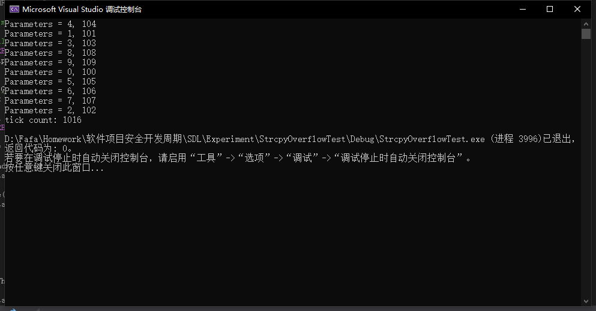
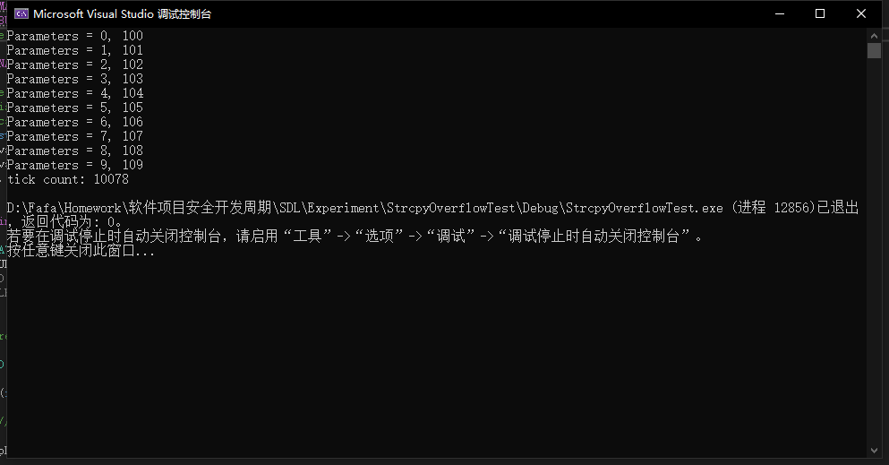
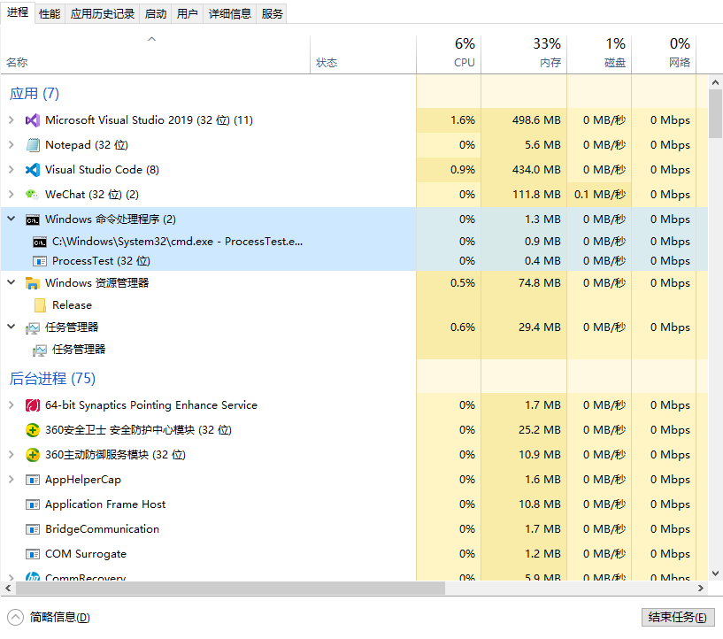

# 线程与进程实验

## 线程与进程的概念

> 进程：指在系统中能**独立运行并作为资源分配的基本单位**，它是由一组机器指令、数据和堆栈等组成的，是一个能独立运行的活动实体；
  线程：线程是进程中的一个实体，作为**系统调度和分派的基本单位**，线程不具有系统资源，仅适用进程的资源。Linux下的线程看作轻量级进程。

## 实验过程与分析

### 线程

* Windows下使用CreateThread创建线程，此代码为多线程，注释掉第七行的宏定义，即为单线程。
* 通过代码构造线程并对其运行方式进行分析。
* 代码取自网址https://docs.microsoft.com/en-us/windows/win32/api/processthreadsapi/nf-processthreadsapi-createthread并进行了修改删除了报错部分代码

```c++
#include <windows.h>
#include <tchar.h>
#include <strsafe.h>

#define MAX_THREADS 10
#define BUF_SIZE 255
#define MULTI_THREAD

DWORD WINAPI MyThreadFunction(LPVOID lpParam);

// Sample custom data structure for threads to use.
// This is passed by void pointer so it can be any data type
// that can be passed using a single void pointer (LPVOID).
typedef struct MyData {
	int val1;
	int val2;
} MYDATA, * PMYDATA;


int _tmain()
{
	PMYDATA pDataArray[MAX_THREADS];
#ifdef MULTI_THREAD
	DWORD   dwThreadIdArray[MAX_THREADS];
	HANDLE  hThreadArray[MAX_THREADS];
#endif

	// Create MAX_THREADS worker threads.

	DWORD start = GetTickCount();

	for (int i = 0; i < MAX_THREADS; i++)
	{
		// Allocate memory for thread data.

		pDataArray[i] = (PMYDATA)malloc(sizeof(MYDATA));

		if (pDataArray[i] == NULL)
		{
			// If the array allocation fails, the system is out of memory
			// so there is no point in trying to print an error message.
			// Just terminate execution.
			ExitProcess(2);
		}

		// Generate unique data for each thread to work with.

		pDataArray[i]->val1 = i;
		pDataArray[i]->val2 = i + 100;

		// Create the thread to begin execution on its own.
		
#ifdef MULTI_THREAD

		hThreadArray[i] = CreateThread(
			NULL,                   // default security attributes
			0,                      // use default stack size  
			MyThreadFunction,       // thread function name
			pDataArray[i],          // argument to thread function 
			0,                      // use default creation flags 
			&dwThreadIdArray[i]);   // returns the thread identifier 

		// Check the return value for success.
		// If CreateThread fails, terminate execution. 
		// This will automatically clean up threads and memory. 

		if (hThreadArray[i] == NULL)
		{
			printf("CreateThread Error(%d)", GetLastError());
			ExitProcess(3);
		}
#else
		MyThreadFunction(pDataArray[i]);
#endif
	} // End of main thread creation loop.

	// Wait until all threads have terminated.
#ifdef MULTI_THREAD
	WaitForMultipleObjects(MAX_THREADS, hThreadArray, TRUE, INFINITE);
#endif

	DWORD end = GetTickCount();
	printf("tick count: %d\n", end - start);

	// Close all thread handles and free memory allocations.
#ifdef MULTI_THREAD

	for (int i = 0; i < MAX_THREADS; i++)
	{
		CloseHandle(hThreadArray[i]);
		if (pDataArray[i] != NULL)
		{
			free(pDataArray[i]);
			pDataArray[i] = NULL;    // Ensure address is not reused.
		}
	}
#endif
	return 0;
}


DWORD WINAPI MyThreadFunction(LPVOID lpParam)
{
	PMYDATA pDataArray;
	pDataArray = (PMYDATA)lpParam;
	Sleep(1000);
	printf("Parameters = %d, %d\n", pDataArray->val1, pDataArray->val2);
	return 0;
}

```

此代码使用CreateThread()创建十个线程，在实际运行过程中，线程并不以0,1,2,3顺序执行，而是以混乱的顺序分别进行，这说明代码产生了10个并行的进程且由于运行时间的不同导致输出时间不同（线程的运行时间均为1000ms），tick count记录了从开始创建十个进程到十个进程执行结束的时间，为线程中sleep（）的时间，即线程的运行时间



* createthread()官方版本

```c++
HANDLE CreateThread(
                    LPSECURITY_ATTRIBUTES lpThreadAttributes,
                    DWORD dwStackSize,
                    LPTHREAD_START_ROUTINE lpStartAddress,
                    LPVOID lpParameter,
                    DWORD dwCreationFlags,
                    LPDWORD lpThreadID
                   );
```

* 对比createthread()函数原型与构造的函数进行分析
  * 参数的含义如下：
  > lpThreadAttrivutes：指向SECURITY_ATTRIBUTES的指针，用于定义新线程的安全属性，一般设置成NULL；
  > dwStackSize：分配以字节数表示的线程堆栈的大小，默认值是0；
  > lpStartAddress：指向一个线程函数地址。每个线程都有自己的线程函数，线程函数是线程具体的执行代码；即前文中的MyThreadFunction
  > lpParameter：传递给线程函数的参数；即上段代码中的lpParam
  > dwCreationFlags：表示创建线程的运行状态，其中CREATE_SUSPEND表示挂起当前创建的线程，而0表示立即执行当前创建的进程；在代码中默认为0，表示执行创建的进程
  > lpThreadID：返回新创建的线程的ID编号；
  > 如果函数调用成功，则返回新线程的句柄，调用WaitForSingleObject函数等待所创建线程的运行结束。

* 注释掉第七行代码后，程序变成单线程，程序一个线程一个线程地执行，可看到输出顺序为0，1，2按顺序输出，总时长约为10个线程的总调度时间，效率远低于多线程并发运行。

```c
//#define MULTI_THREAD
```



### 进程

* Windows下使用CreateProcess()创建进程，CreateProcess用来创建一个新的进程和它的主线程，这个新进程运行指定的可执行文件。函数原型如下

```c++
BOOL CreateProcess(
　LPCTSTR lpApplicationName, // 应用程序名称
　LPTSTR lpCommandLine, // 命令行字符串
　LPSECURITY_ATTRIBUTES lpProcessAttributes, // 进程的安全属性
　LPSECURITY_ATTRIBUTES lpThreadAttributes, // 线程的安全属性
　BOOL bInheritHandles, // 是否继承父进程的属性
　DWORD dwCreationFlags, // 创建标志
　LPVOID lpEnvironment, // 指向新的环境块的指针
　LPCTSTR lpCurrentDirectory, // 指向当前目录名的指针
　LPSTARTUPINFO lpStartupInfo, // 传递给新进程的信息
　LPPROCESS_INFORMATION lpProcessInformation // 新进程返回的信息
);
```

> 一个线程调用它来首先创建一个进程内核对象，进程内核对象是用来管理这个新的进程的，然后，系统为新进程创建虚拟地址空间，并将可执行文件（和DLL）的代码和数据加载到这个地址空间，然后系统为新进程的主线程创建一个线程内核对象。

* 代码选自https://docs.microsoft.com/en-us/windows/win32/api/processthreadsapi/nf-processthreadsapi-createprocessa

```c++
#include <windows.h>
#include <stdio.h>
#include <tchar.h>

void _tmain(int argc, TCHAR* argv[])
{
	STARTUPINFO si;
	PROCESS_INFORMATION pi;

	ZeroMemory(&si, sizeof(si));
	si.cb = sizeof(si);
	ZeroMemory(&pi, sizeof(pi));

	if (argc != 2)
	{
		printf("Usage: %s [cmdline]\n", argv[0]);
		return;
	}

	// Start the child process. 
	if (!CreateProcess(NULL,   // No module name (use command line)
		argv[1],        // Command line
		NULL,           // Process handle not inheritable
		NULL,           // Thread handle not inheritable
		FALSE,          // Set handle inheritance to FALSE
		0,              // No creation flags
		NULL,           // Use parent's environment block
		NULL,           // Use parent's starting directory 
		&si,            // Pointer to STARTUPINFO structure
		&pi)           // Pointer to PROCESS_INFORMATION structure
		)
	{
		printf("CreateProcess failed (%d).\n", GetLastError());
		return;
	}

	// Wait until child process exits.
	WaitForSingleObject(pi.hProcess, INFINITE);

	// Close process and thread handles. 
	CloseHandle(pi.hProcess);
	CloseHandle(pi.hThread);
}
```

使用命令行运行刚刚生成的ProcessTest.exe文件创建进程Notepad.exe



- 在任务管理器中可看到ProcessTest.exe与Notepad.exe均在运行。
- 关闭掉Notepad后ProcessTest.exe进程也随之关闭。
- 由于进程的执行过程中，当父进程生成子进程后，需要等待子进程完成才可以结束，实验中编译的ProcessTest进程内- 容为生成Notepad.exe的子进程，在子进程完成后即可结束。由此可以推断notepad.exe为ProcessTest.exe创建的子进程。

## 实验总结

实验中分别测试了创建线程和创建进程的过程，对进程和线程的属性和构造方法有了深刻的理解。同时两者的运行过程有进行分析，模拟了线程的两种运行机制和进程间的依赖关系，系统中程序的运行过程有了更深层次的体会。

## 参考资料

* https://blog.csdn.net/u012877472/article/details/49721653
* https://blog.csdn.net/hgy413/article/details/6200983#